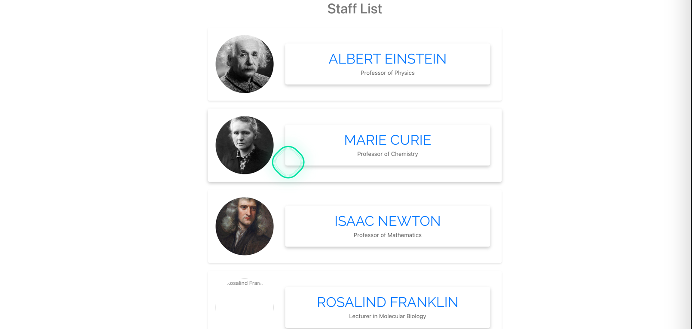
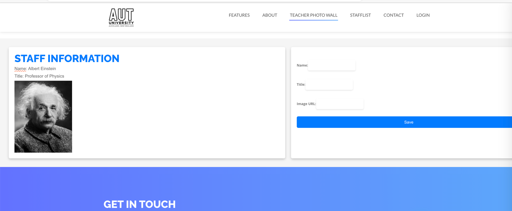
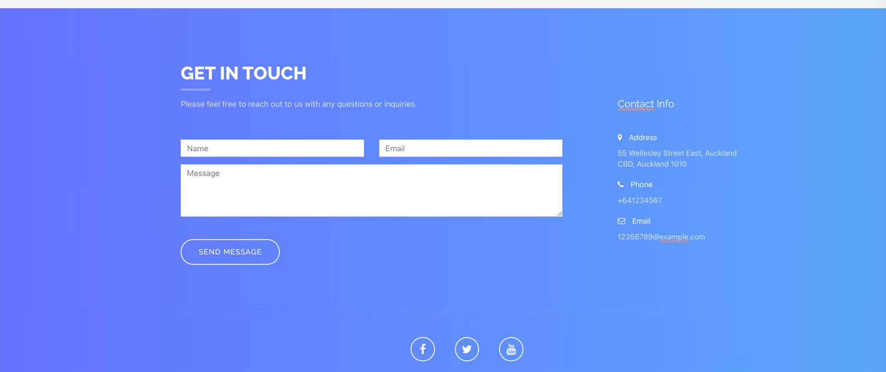

# Teacher Staff website

The frontend is in: clinet_web
The backend is in: server

The front-end start command is
npm install
npm run start

Backend startup command: (no need to install dependencies already installed)
npm run start

Implementation functions:
Home page, Staff list, contract us page
The editing function of staff
Detailed description of Staff (contains various information, paper view, etc.)
### Main page

### Staff List

### Contact Us

### Staff Detail

### Staff Edit

